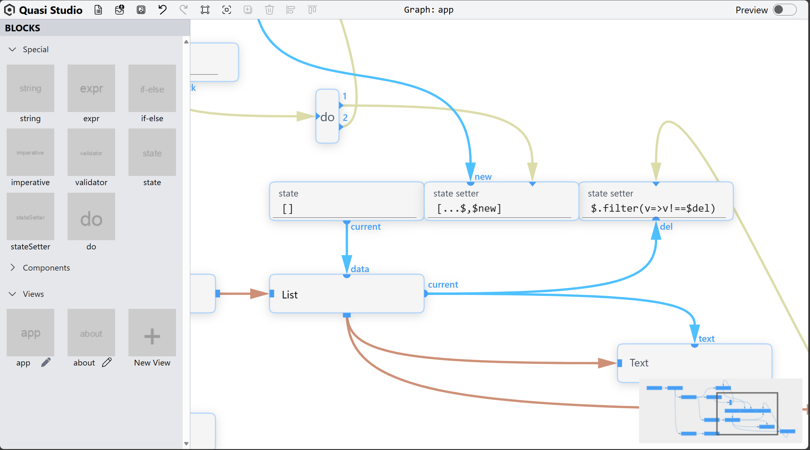
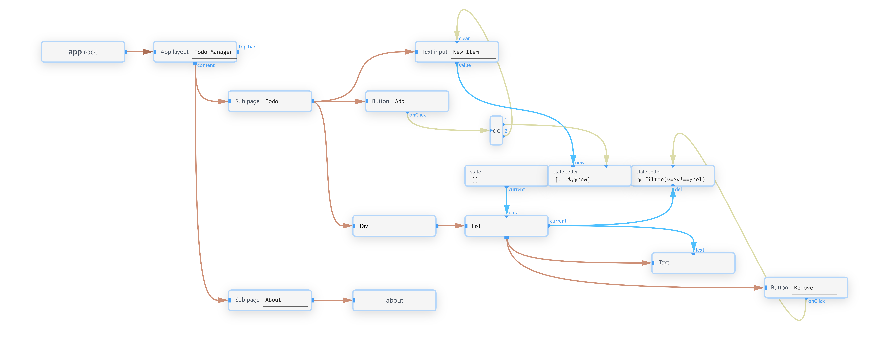
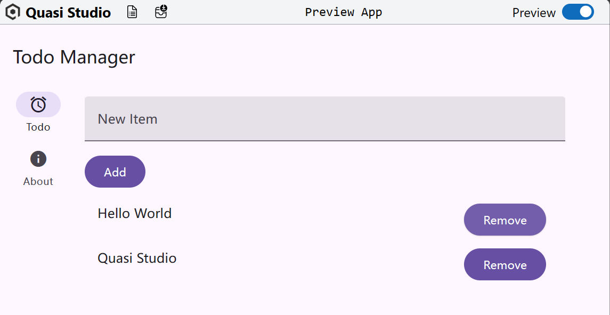
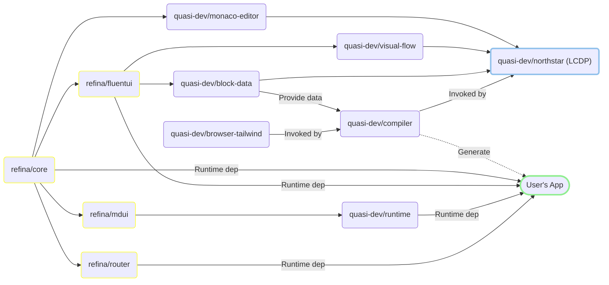

# Quasi Studio


A [structure-oriented](https://github.com/Structure-oriented-Framework/SOF) and unique LCDP (Low-Code Development Platform).

**Try it now at [quasi-studio.vercel.app](https://quasi-studio.vercel.app)**. An example project is [here](./docs/examples/todo-app.q.json).

- Designed for professional developers
- Intuitive and easy to use
- Build with [Refina.js](https://refina.vercel.app)

> _Licensed under **GNU GPL v3**_

## Preview

| Designer UI    |          |
| -------------- | -------------------------------------------------- |
| Quasi Graph    |    |
| Output Preview |  |

## Features

### 📦 Block

- **Special Blocks**: Used to process data and control the flow of the application.
- **Component Blocks**: Used to build the layout of the application.
- **View Blocks**: Used to split and reuse the layout of the application.

### 🔌 Socket

There are several sockets in a block, and they are used to connect to other blocks.

### 🧵 Line

Connect one socket to another.

### Different Types of Sockets and Lines

> Only the same type of Socket and Line can be connected to each other.

#### 🌳Layout Line / Layout Socket

Control the layout.

The socket is square, and the line is brown.

#### 🧳Data Line / Data Socket

"Pull" data from one block to another.

The socket is semi-circular, and the line is blue.

#### ⚡Event Line / Event Socket

"Push" an event from one block to another.

The socket is triangular, and the line is green.

### So, How to Use Quasi Studio?

1. Think about the layout and logic of your app
2. Drag the corresponding Component Block to the graph
3. Connect these blocks with Layout Line
4. Handle events. Connect the event from the Component Block to the block that handles the event
5. Get data. Connect the data from the Component Block to the block that needs the data

### Other Functions

👁 Quick preview

↩️ Undo /↪️ Redo

⬇️ Import / ⬆️ Export / 🔄️ Autosave

✏️ Embed Monaco Editor

📸 Generate high-resolution images of your design graph

## Design Principles

### Fine-grained or coarse-grained?

- Most of the low-code platforms are coarse-grained, which means they provide a set of predefined components and you can only use them to build your app.
- Quasi Studio is fine-grained, which means you can build your own components and use them in the graph.
- However, unlike Scratch, Quasi Studio is designed for professional developers and focuses on development efficiency.

### Mix Layout and Logic

- Traditional low-code platforms separate layout and logic, which means you can only use the visual editor to design the layout and write code to implement the logic.
- Quasi Studio mixes layout and logic, which means you can use the visual editor to design the layout and implement the logic at the same time.

## Development

### Directory Structure

This is a monorepo, and the directory structure is as follows:

1. `browser-tailwind`: Tailwind Compiler for the browser.
2. `compiler`: Compile the graph to the runnable code.
3. `mdui2-dts`: Generate a single DTS file of MdUI
4. `monaco-editor`: Monaco Editor as a Refina component.
5. ⭐`northstar`: The major part of Quasi Studio.
6. `runtime`: Runtime for the Quasi Studio generated app.
7. ⭐`visual-flow`: DnD library for building blocks, lines, and sockets.

### Dependency Graph

> Together with [Refina.js](https://refina.vercel.app).



### Start Development

```bash
pnpm dev
```
